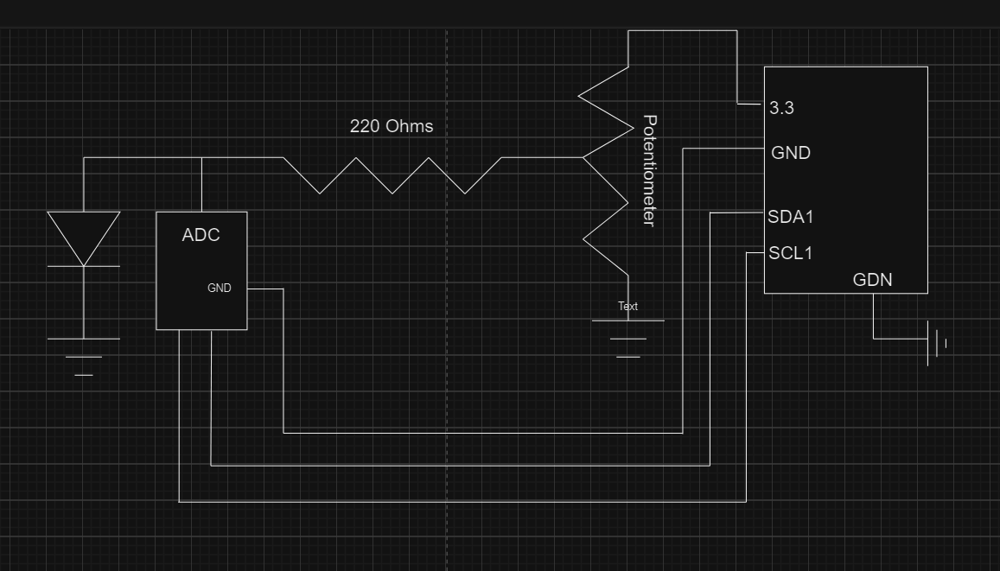
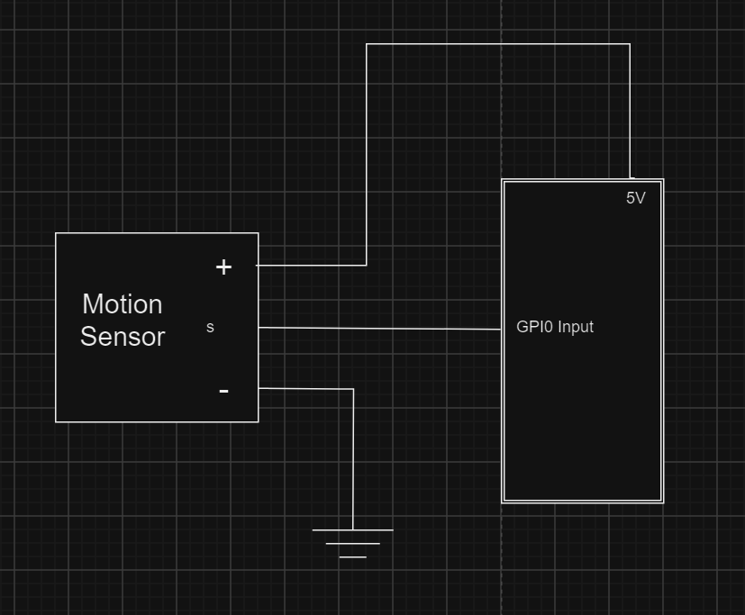

# Data Communication Project

## Overview

This project is a modular system for building sensor-driven networks, focusing on wildlife monitoring through automated data and image capture. The project is structured around milestones representing incremental development stages, from simple sensor integration to a distributed event-driven system using Docker, gRPC, and MQTT for communication.

The system includes:
- **Sensor Nodes**: Devices (e.g., Raspberry Pi with connected hardware) equipped with cameras and sensors (motion, LED, etc.) that detect events (e.g., animal movement) and capture images.
- **Event Queue**: A thread-safe queue system for storing and associating detected events with timestamps for further processing.
- **Middleware (gRPC/MQTT Server)**: Handles sensor management, command forwarding, and relays trigger requests from user interfaces to sensors.
- **Computer Dashboard Node**: A user-facing application for selecting sensors, triggering actions (e.g., image capture), and receiving data from multiple nodes for monitoring and analysis.

## Features

- **Real-time Wildlife Event Detection**: Uses motion sensors and other hardware to identify wildlife activities (e.g., "Deer Grazing", "Bear Sleeping"). Each event is timestamped for traceability.
- **Automated Image Capture**: When triggered (on motion or by command), the system captures and stores a sequence of images with voltage readings and clear labeling based on detected events.
- **Thread-safe Event Processing**: Employs thread locks and semaphores to ensure reliable data capture and processing in a multi-threaded environment.
- **Mock Sensors for Testing**: Includes mock sensor implementations to simulate events and test the event queue without real hardware.
- **Dockerized Deployment**: Milestone 4 provides Dockerfiles for each major component, facilitating reliable multi-node deployment.
- **Extensible Communications**: Utilizes gRPC for RPC-based sensor interactions and MQTT for lightweight event publishing/subscription. 
- **Security Considerations**: (Milestone 4) Support for public/private key exchange for sensor authentication (see `SendPublicKeyToSensor` methods).
- **Protobuf-based Communications**: Protocol buffer definitions and code generation to standardize communication between services.

## Project Structure

- `milestone1/`: Basic hardware and sensor integration for event detection and image capture.
- `milestone2/`: Introduction of event queues, threading, timestamping, and simulated sensors.
- `milestone3/`: Adds gRPC-based APIs for remote capturing, sensor discovery, and multi-sensor management.
- `milestone4/`: Complete distributed setup with Dockerized components (sensors, middleware/server, desktop operator) and robust network communication.
- `milestone4/proto/`: Protocol buffer definitions and code generation utilities.
- `screenshots/`: Schematics for initial sensor wiring.

## Example: Event-Driven Image Capture

- Events such as "Motion Detected" trigger the `WildlifeCamera` class to:
    - Record the event with a timestamp via `EventQueue`.
    - Activate camera to capture and save a burst of images with metadata in the filename (event, time, voltage).
- See: [`milestone2/wildlife_camera.py`](./milestone2/wildlife_camera.py) and [`milestone2/event_queue.py`](./milestone2/event_queue.py)

## Running the Project

1. **Install Requirements**: 
   Each milestone or component may have a `requirements.txt` file. For Docker-based setups, requirements are handled in the Dockerfile.
   ```bash
   pip install -r requirements.txt
   ```

2. **Run by Milestone**:
    - Follow instructions in each milestone's README or use provided Dockerfiles in `milestone4/`.
    - Example: Build and run the sensor node
        ```bash
        cd milestone4/sensors
        docker build -t sensor-node .
        docker run --rm -p 60321:60321 sensor-node
        ```

3. **Connect Nodes**:
    - Middleware (server), dashboard (operating_pc), and sensors communicate via gRPC and MQTT.
    - Use the dashboard to discover sensors, issue capture commands, and monitor results.

## Schematics

LED and Motion Sensor setup (see `screenshots/`):




## Project Highlights

- **Milestone-driven implementation**: See the `milestone4/README.md` for component details and system diagrams.
- **Mocking and real hardware**: Easy toggling between simulated data and real sensor readings.
- **Customizable events**: Extendable event types for new wildlife scenarios or non-wildlife sensor monitoring.

## License

MIT License (see `LICENSE` file).
